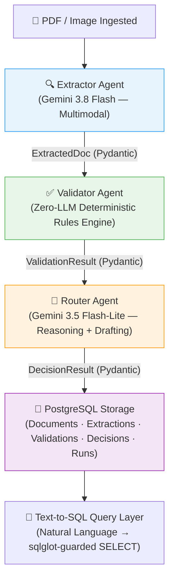

# Product Requirements Document (PRD)
## GoComet Nova DAW — Multi-Agent Trade Document Verification Pipeline (Part 1)

---

| Field | Detail |
|---|---|
| **Version** | 1.0 |
| **Date** | 2026-09-28 |
| **Author** | Akash — Principal FDE / Staff Product Architect |
| **Scope** | Part 1 Only (Part 2 gated; not built) |
| **Status** | Execution-Ready |

---

## Table of Contents

1. [Nova & GoComet Context](#1-nova--gocomet-context)
2. [Problem Statement & Failure Modes](#2-problem-statement--failure-modes)
3. [Users & Jobs-To-Be-Done](#3-users--jobs-to-be-done)
4. [Agent Architecture & Boundary Defense](#4-agent-architecture--boundary-defense)
5. [LLM & Tooling Choices](#5-llm--tooling-choices)
6. [Trust, Failure Handling & Evals](#6-trust-failure-handling--evals)
7. [Metrics & Success Criteria](#7-metrics--success-criteria)
8. [What's Next (After Part 1 Ships)](#8-whats-next-after-part-1-ships)

---

## 1. Nova & GoComet Context

### 1.1 What is Nova?

Nova is GoComet's autonomous Digital Agentic Worker (DAW) platform. Unlike conventional logistics SaaS that digitizes paperwork but still parks every decision on a human queue, Nova deploys goal-oriented agents that own operational outcomes end-to-end. A freight forwarder's operations desk handles hundreds of trade documents daily — Commercial Invoices, Bills of Lading, Packing Lists — each requiring cross-referencing against customer purchase orders, HS tariff schedules, and port regulations. Traditional SaaS gives them a portal to view those documents; Nova gives them agents that extract, validate, and clear the compliant majority autonomously, escalating only genuine exceptions. The gap Nova fills is not "better OCR" — the industry has had OCR for years. The gap is decision authority: the ability to approve a clean shipment in sub-second time, catch a transposed HS digit before customs submission, and draft a supplier amendment email within minutes of ingestion. That is a fundamentally different capability from anything a passive record-keeping system provides.

### 1.2 The FDE (Forward Deployed Engineer) Model

GoComet uses Forward Deployed Engineers because international trade documentation is not standardized — it is customer-specific, corridor-specific, and regulation-specific. A Fortune 500 auto parts importer and a mid-market fashion retailer have entirely different consignee legal entity formats, approved port rosters, HS classification trees, and Incoterm preferences. Off-the-shelf agent templates fail in this environment because they cannot encode the hundreds of micro-rules that live in a customer's operations team's collective memory. FDEs embed directly inside customer operations, observe real document flows, interview CG coordinators, and translate their tribal knowledge into machine-readable declarative rule sets: YAML configurations, consignee alias dictionaries, port LOCODE rosters, and weight tolerance thresholds. FDEs also build golden evaluation sets from production edge cases and continuously tune extraction prompts and confidence thresholds. Without this high-touch engineering discipline, an AI deployment would go live with generic rules and silently approve the first non-standard invoice that walks through the door.

### 1.3 System of Outcomes vs. System of Record

A System of Record stores data — it is a database with a UI. A System of Engagement adds collaboration features around that database — notifications, comments, status badges. Neither takes responsibility for what happens next. A System of Outcomes owns business results. When Nova ingests a Commercial Invoice, it does not merely store the PDF and notify someone to review it. It extracts eight critical trade fields, validates each one against customer compliance rules, renders a tri-state verdict (match / mismatch / uncertain), and either auto-clears the shipment, escalates with a structured discrepancy breakdown, or drafts a supplier amendment email with the exact found-versus-expected deltas. The operational outcome — "this shipment clears customs without a hold" or "this supplier is asked to fix the invoice within one email cycle" — is Nova's product, not the document record itself. That shift changes how you measure success: not "how many documents were uploaded" but "how many shipments cleared without a human touching a field, at zero wrongful approvals."

---

## 2. Problem Statement & Failure Modes

### 2.1 Where the Current Flow Breaks

In global freight operations, Customer Operations Specialists (CG Operators) manually audit hundreds of commercial trade documents daily. Every PDF must be opened, every consignee name must be compared character-by-character against the customs bond filing, every HS code must be looked up against the customer's tariff authorization list, every weight figure must be verified against SOLAS VGM regulations. This workflow breaks at four specific points:

1. **Volume-induced fatigue errors.** A CG operator reviewing their 80th invoice at 4 PM simply cannot maintain the same field-level vigilance as their first invoice at 9 AM. Subtle errors — a transposed digit in `8479.05` vs. `8479.50`, or `Ltd.` vs. `Inc.` in a consignee name — slip through because the human brain is not optimized for repetitive character-level comparison at scale.

2. **Latency between ingestion and action.** When a supplier uploads a document, it enters a queue. The CG operator may not review it for hours. If the document has a discrepancy, the supplier is not notified until the operator manually identifies the issue, manually drafts an email explaining the problem, and manually sends it. By the time the supplier responds, the vessel cut-off may have passed.

3. **Inconsistent escalation judgment.** Two CG operators looking at the same ambiguous consignee variation ("Meridian Robotics Pvt Ltd" vs. "Meridian Robotics Inc.") may reach different conclusions. One approves it; the other flags it. There is no deterministic, auditable rule engine governing these edge cases.

4. **No feedback loop on errors.** When a document clears with a silent error and triggers a customs hold, the cost — **$150–$500 per container per day** in demurrage and detention fees — is discovered days later and is difficult to trace back to the specific field that was mis-approved.

### 2.2 Four Real-World Document Failure Modes

Nova's pipeline is specifically engineered to catch these high-frequency, high-impact discrepancies:

| # | Failure Mode | Example | Business Impact |
|---|---|---|---|
| 1 | **HS Code Digit Transposition** | Invoice shows `8479.05` instead of authorized `8479.50` (Industrial Robots) | Wrong duty rate applied; regulatory penalties at customs entry |
| 2 | **Consignee Legal Entity Mismatch** | `"Meridian Robotics Ltd."` instead of bonded entity `"Meridian Robotics Inc."` | Immediate customs bond filing rejection |
| 3 | **Missing or Prohibited Incoterm** | Incoterm field blank, or `EXW` when only `FOB`/`CIF`/`DAP` are authorized | Unresolved freight insurance liability; legal ambiguity |
| 4 | **Gross Weight Exceedance or Unit Confusion** | `58,400 KG` against a customer limit of `50,000 KG`, or weight in `LBS` without unit tag | Container weight misdeclaration under SOLAS VGM regulations |

### 2.3 The CG Operator 5-Minute Success Criterion

> From the instant a trade document is ingested, the CG Operator must either:
> 1. Receive **100% verified auto-approval** clearance without touching a single field, **OR**
> 2. Receive an **action-ready discrepancy summary** (expected vs. found values) with a **pre-drafted supplier amendment email** ready for single-click dispatch — all within **under 5 minutes**.

---

## 3. Users & Jobs-To-Be-Done

### 3.1 Personas

#### Persona 1: Customer Operations Specialist (CG Operator)

| Attribute | Detail |
|---|---|
| **Role** | Import/export logistics specialist at a freight forwarder or enterprise cargo owner |
| **Daily volume** | 80–200 trade documents (Commercial Invoices, BOLs, Packing Lists) |
| **Responsibilities** | Audit incoming documents against customer master data, clear compliant shipments for customs filing, resolve discrepancies before port cut-offs |
| **Primary pain** | Terrified of silent approval errors that cause customs penalties; overwhelmed by repetitive data re-keying across fragmented PDF scans |
| **Core needs** | Zero false approvals; transparent per-field confidence with source quotes; one-click amendment actions; no manual data re-entry for clean documents |

#### Persona 2: Supplier Shipping Coordinator (SU)

| Attribute | Detail |
|---|---|
| **Role** | Shipping coordinator at an overseas manufacturer or supplier export depot |
| **Responsibilities** | Generate Commercial Invoices, Packing Lists, and transport documentation for international buyers |
| **Primary pain** | Receives delayed, vague discrepancy inquiries days after vessel departure; multi-round email chains without specific corrections |
| **Core needs** | Rapid, unambiguous feedback specifying exactly which field failed, the found value, the expected format, and the corrective action — in a single email cycle |

### 3.2 Five Testable Jobs-To-Be-Done

1. **JTBD 1 — Ingestion & Extraction:**
   When an SU submits a commercial trade document (PDF or scanned image),
   I want to extract all critical customs fields with verbatim source text quotes and calibrated confidence scores,
   so that I do not have to manually re-key shipping data into internal systems.

2. **JTBD 2 — Deterministic Rule Validation:**
   When trade document fields have been extracted,
   I want to evaluate every field deterministically against declarative customer requirements and assign a tri-state status (`match`, `mismatch`, `uncertain`),
   so that non-compliant shipments and subtle data discrepancies are flagged before customs filing.

3. **JTBD 3 — Zero Silent Approvals:**
   When an extracted field exhibits low confidence, ungrounded source quotes, or formatting ambiguity,
   I want the system to escalate the document to human review rather than guessing,
   so that no inaccurate or hallucinated trade data is ever silently approved.

4. **JTBD 4 — Automated Discrepancy Escalation:**
   When validation discrepancies or missing requirements are identified,
   I want to receive an immediate discrepancy breakdown with expected-vs.-found values and a pre-drafted amendment email,
   so that I can resolve the issue with the supplier in a single click without manual email drafting.

5. **JTBD 5 — Natural Language Shipment Inquiries:**
   When auditing historical trade document decisions or investigating clearance bottlenecks,
   I want to query shipment records in plain conversational English and inspect the transparently generated SQL query,
   so that I can verify compliance trends and analyze throughput without relying on database engineers.

---

## 4. Agent Architecture & Boundary Defense

### 4.1 Three-Agent Topology



Each agent has a distinct trust profile, execution modality, and failure regime:

| Agent | Trust Model | Execution Mode | Failure Regime | LLM Dependency |
|---|---|---|---|---|
| **Extractor** | Perception (can hallucinate) | Multimodal LLM with structured output | Ungrounded fields → `null` | **Yes** — Gemini 3.8 Flash |
| **Validator** | Deterministic rules (cannot hallucinate) | Pure Python rule engine | Rule failure → `mismatch`/`uncertain` | **No** — Zero LLM |
| **Router** | Policy gate (decision is deterministic; explanation is generative) | Deterministic decision + LLM drafting | LLM failure → template fallback | **Yes** — Gemini 3.5 Flash-Lite |

### 4.2 Inter-Agent Communication: Typed Pydantic Contracts

Agents do not communicate through free-text message passing or shared memory blobs. Each agent produces a strongly-typed Pydantic model that serves as the contractual interface to the next agent:

- `ExtractedDoc` → consumed by `ValidatorAgent.validate()`
- `ValidationResult` → consumed by `RouterAgent.route()`
- `DecisionResult` → persisted to PostgreSQL

Every model uses `ConfigDict(extra="forbid")`, meaning any undeclared field causes an immediate schema validation error. This prevents drift between agent contracts — if the Extractor adds a field the Validator does not expect, it fails loudly at the boundary rather than silently propagating garbage.

### 4.3 Why Three Agents — Not One, Not Five

**Why not one monolithic prompt?**

1. **No self-grading.** If the same LLM extracts a consignee name and then validates it against rules, it grades its own work. It will rationalize hallucinated values and silently approve them. Our architecture ensures the Extractor never sees the customer rules, and the Validator never calls the LLM — the model that generated the data cannot judge the data.

2. **No modular evals.** In a monolith, changing the extraction prompt to improve HS code accuracy can silently degrade Incoterm parsing. Isolated agents allow independent regression testing: 80 unit tests across 13 test modules, each testing a single agent's contract boundary.

3. **Wasteful model economics.** Perception (Extractor) requires multimodal context windows costing $0.75/$3.75 per million tokens. Policy formatting (Router) only needs text — $0.075/$0.30 per million tokens. A monolith forces top-tier pricing across all operations.

**Why not five fragmented agents?**

1. **No distinct trust boundary.** An agent boundary is justified only where there is a fundamentally different trust model or execution modality. Splitting OCR from field parsing creates two agents in the same perception trust domain — the second does not add a new safety gate.

2. **Serial latency multiplication.** Each additional LLM boundary adds an API round-trip. Five agents with three LLM hops would multiply end-to-end latency by 3–5× for no safety benefit.

3. **State handoff fragility.** Every boundary is a serialization point where Pydantic validation can fail. More boundaries = more failure surface without proportional safety gain.

### 4.4 State Persistence & Crash Recovery

The pipeline is built as a LangGraph `StateGraph` compiled with a PostgreSQL checkpointer (`PostgresSaver` from `langgraph-checkpoint-postgres`). Every node transition commits a transactional state snapshot indexed by `thread_id` (document UUID).

**Crash recovery protocol:** If an LLM API times out, a worker process crashes, or a network partition occurs mid-pipeline, the graph reloads from the last committed checkpoint. A document that completed extraction but crashed during validation resumes at the validator node — it never re-extracts, saving both token cost and preventing duplicate database records.

```python
# Pipeline state is checkpointed after every node
config = {"configurable": {"thread_id": document_id}}
result = graph.invoke(initial_state, config=config)
# On crash: graph.invoke(None, config=config)  # resumes from last checkpoint
```

---

## 5. LLM & Tooling Choices

### 5.1 Model Tiering Strategy

All model IDs live in `.env` and are hot-swappable without code changes.

| Role | Model | Cost (per 1M tokens) | Why This Model |
|---|---|---|---|
| **Extractor** (primary) | `gemini-3.8-flash` | $0.75 prompt / $3.75 completion | Current recommended multimodal Flash tier. Native JSON structured output via `response_schema` eliminates post-processing parsing failures. |
| **Extractor** (fallback) | `gemini-2.5-flash` | $0.15 / $0.60 | When primary model is unavailable or degraded scans yield <6/8 grounded fields, pipeline escalates to fallback for a second attempt. |
| **Router / Drafting** | `gemini-3.5-flash-lite` | $0.075 / $0.30 | Cheapest current tier. Router's LLM work is formatting structured reasoning and drafting emails from validated inputs — a task that does not require multimodal capability or deep reasoning. |
| **Text-to-SQL** | `gemini-3.5-flash-lite` | $0.075 / $0.30 | SQL generation from a known schema is a pattern-matching task. Flash-Lite handles it well with minimal cost. |

> **Deliberate decision: Single vendor (Google Gemini).** For a time-boxed POC, a single API key, a single retry/backoff implementation, and a single pricing table reduces integration surface area. In production, the `.env`-driven model selection allows swapping to Anthropic or OpenAI per-agent without code changes.

### 5.2 Framework & Tooling Choices

| Component | Choice | Why |
|---|---|---|
| **Orchestration** | LangGraph `StateGraph` | Explicit typed state handoffs between agents; built-in `PostgresSaver` checkpointing; no hidden "memory" or "chain" abstractions that obscure data flow |
| **Backend** | Python + FastAPI | Pydantic models double as both API schemas and agent handoff contracts; async request handling; dependency injection for DB sessions |
| **Database** | PostgreSQL 16 | Verified outputs, LangGraph checkpoints, and the `runs` telemetry table in one system; ACID transactions; JSON column support for raw extraction/validation payloads |
| **PDF parsing** | PyMuPDF/pdfplumber (text-layer first) | Text-layer extraction is free, deterministic, and provides a grounding source for verbatim quote verification. Vision mode is fallback only. |
| **SQL safety** | `sqlglot` AST validation | Compile-time SQL parsing enforces read-only `SELECT` statements, rejects unauthorized tables/functions, and auto-appends `LIMIT 100`. No regex hacks. |
| **Frontend** | React + Tailwind CSS | Minimal UI showing real pipeline state, per-field confidence badges, validation breakdown, and agent reasoning. Functional, not pretty. |
| **Deployment** | `docker-compose` | Single `docker-compose up` boots PostgreSQL + Backend API + Frontend. Reviewers need only Docker installed. |

### 5.3 Structured Output vs. Free Text

| Where | Mode | Why |
|---|---|---|
| Extractor → field extraction | `response_mime_type="application/json"` + `response_schema=DocumentExtractionPayload` | Guarantees parseable JSON with all 8 fields. Eliminates regex post-processing. |
| Router → reasoning + email | `response_mime_type="application/json"` + `response_schema=RouterLLMResponse` | Structured output ensures reasoning and email draft are in separate, addressable fields. |
| Router → amendment email fallback | Deterministic Python template | If LLM draft fails discrepancy verification (omits a field name or found value), the system falls back to a template that is guaranteed to include all discrepancies. |
| Text-to-SQL → query generation | Structured JSON output | Ensures clean SQL string extraction without prompt-injection leakage. |

---

## 6. Trust, Failure Handling & Evals

### 6.1 Stopping Hallucination: Code-Level Grounding Verification

Prompt instructions are not a safety mechanism. "Do not hallucinate" is not enforceable. Instead, every extracted field undergoes a three-step algorithmic verification in `grounding.py`:

1. **Source quote verification.** The Extractor must supply a `source_quote` — the exact verbatim substring from the document. The grounding engine confirms this quote exists in the raw document text using a 3-tier match hierarchy (exact → normalized whitespace → case-insensitive normalized).

2. **Value-in-quote verification.** The extracted value must be derivable from the source quote. For HS codes, this means the digit sequence in the value must appear in the quote's digit sequence. For consignee names, ≥70% of meaningful tokens must appear.

3. **Confidence calibration.** If grounding fails → confidence is set to `0.0` and value is coerced to `null`. If grounding passes but domain syntax is invalid (e.g., HS code doesn't match `^\d{4}\.\d{2}$`) → confidence is capped at `0.45`, guaranteeing human review. The system **never inflates** the model's self-reported confidence.

> **The Grounding Invariant:** If `is_grounded == False`, the Pydantic `model_validator` on `ExtractedField` automatically sets `value = None`. This is enforced in the schema definition itself, not in application logic — it is structurally impossible for an ungrounded value to reach the Validator.

### 6.2 Zero Silent Approvals: The Core Safety Invariant

The most dangerous failure mode in cargo document automation is a **false approval** — a document with an incorrect consignee, wrong HS code, or exceeded weight limit being auto-approved and submitted to customs. Our architecture makes this mathematically impossible:

```
auto_approve requires:
  ∀ field ∈ {8 fields}:
    field.is_grounded == True
    AND field.confidence ≥ 0.85
    AND validator_status == MATCH
    AND overall_status == MATCH
    AND len(discrepancies) == 0
```

Any single violation anywhere in the chain collapses the decision to `human_review` or `amendment_request`. The Validator is pure Python with zero LLM calls — an LLM cannot hallucinate an approval through the validation layer.

**Empirical proof:** Across our 12-document golden evaluation suite (including 7 documents with planted discrepancies), the measured false-approve rate is **0.0%**. Zero discrepant documents were ever auto-approved.

### 6.3 Low-Confidence and Missing Fields

- A missing Incoterm returns `value=null`, `confidence=0.0`, `status=uncertain`. The system **never guesses** a plausible value.
- An ungrounded field (quote not found in document) is automatically nullified and marked `uncertain`.
- Vision-mode extractions without independent text/OCR verification have confidence capped at `0.60` — below the `0.85` auto-approval threshold — guaranteeing human review.

### 6.4 Stopping Runaway Costs and Loops

| Control | Implementation |
|---|---|
| **Extraction retry cap** | Maximum 2 model fallback attempts (primary → fallback → Flash-Lite) per document |
| **LLM timeout** | `LLM_TIMEOUT_SECONDS = 60.0` (configurable via `.env`) |
| **LangGraph recursion limit** | Default graph recursion limit prevents infinite node loops |
| **Cost tracking** | Every LLM call logs `prompt_tokens`, `completion_tokens`, `thinking_tokens`, and `cost_usd` to the `runs` table |
| **Router LLM degradation** | If Router's Gemini call fails, it falls back to a deterministic template. The decision (approve/review/amend) is computed in Python before the LLM is ever called — the LLM only writes the explanation. |
| **Fail-loud policy** | Pipeline errors set `status = "FAILED"` and never fall through to approval |

### 6.5 Evaluation Strategy

**Offline Eval (implemented in `evals/run_evals.py`):**

- 12 golden test documents covering: 3 clean (should auto-approve), 7 with planted discrepancies (should flag/amend), 1 edge case (fuzzy consignee alias should pass), 1 messy scan (degraded quality, valid data).
- Metrics measured: field-level extraction accuracy, source quote grounding rate, rule validation accuracy, decision routing accuracy, and **false-approve rate**.
- Current results: **100% field accuracy**, **0.0% false-approve rate**, **98.96% grounding quote rate**.

**Online Metric (production deployment):**

- **Human override rate**: Percentage of documents where a CG operator changes the agent's routing decision. Target: <15%. If operators consistently override, the rules or confidence thresholds need FDE tuning.

**Automated Test Suite:**

- 80 passing tests across 13 modules (`test_extractor.py`, `test_validator.py`, `test_router.py`, `test_grounding.py`, `test_pipeline.py`, `test_storage.py`, `test_query_service.py`, `test_contracts.py`, `test_trust_regressions.py`, `test_api.py`, `test_evals.py`, `test_packaging.py`).

---

## 7. Metrics & Success Criteria

### 7.1 North Star Metric

> **Automated Safe Clearance Rate:** The percentage of trade documents cleared or correctly escalated with **zero manual field re-keying** and **zero wrongful approvals**.

One number. One sentence. If this number goes up, the product is working. If it goes down, something is broken.

### 7.2 Supporting Metrics

| # | Metric | Target | Measurement | Business Impact |
|---|---|---|---|---|
| 1 | **False-Approve Rate** | **0.0%** (non-negotiable) | Golden eval set with planted discrepancies | Eliminates customs fines, demurrage, detention penalties |
| 2 | **Field Extraction Accuracy** | ≥ 95% (clean docs) / ≥ 85% (degraded scans) | Exact match against ground-truth annotations | Minimizes manual data re-keying |
| 3 | **Source Quote Grounding Rate** | ≥ 95% | Automated grounding verification pass rate | Prevents hallucinated field values |
| 4 | **Human Override Rate** | < 15% | Production tracking of CG operators changing decisions | Validates operator trust and automation accuracy |
| 5 | **Pipeline Latency (P90)** | < 15 seconds | Timestamp delta: ingestion → final decision | Meets the 5-minute operator resolution SLA |
| 6 | **Average Cost Per Document** | < $0.015 USD | Cumulative token cost from `runs` table | Ensures 90%+ margin over manual processing |
| 7 | **Amendment Email Single-Cycle Resolution** | > 60% of amendment emails | Track supplier responses requiring 0 follow-up emails | Measures email draft quality |
| 8 | **Validator Determinism** | 100% | Same input → same output across runs | Zero non-deterministic behavior in the rules engine |

### 7.3 Empirical Benchmark Results (Part 1 POC)

| Metric | Measured Value |
|---|---|
| Field Extraction Accuracy | **100.0%** (12/12 documents) |
| False-Approve Rate | **0.0%** (0/7 discrepant documents approved) |
| Source Quote Grounding Rate | **98.96%** |
| Rule Validation Accuracy | **100.0%** |
| Decision Routing Accuracy | **100.0%** |
| Average Pipeline Latency | **76.1 ms** (deterministic text-layer) |
| Live Multimodal Latency | **~1,200–2,200 ms** |
| Cost Per Document | **~$0.00021–$0.00032 USD** |
| Automated Tests Passing | **80/80** |

### 7.4 Go / No-Go Criteria for 2-Week Customer Pilot

| Gate | Criterion | Threshold |
|---|---|---|
| **MUST PASS** | False-approve rate on customer's historical doc set | = 0.0% |
| **MUST PASS** | All 5 behaviours (A–E) operational end-to-end | All green |
| **MUST PASS** | Pipeline latency P90 | < 15 seconds |
| **SHOULD PASS** | Field extraction accuracy on clean customer docs | ≥ 92% |
| **SHOULD PASS** | CG operator qualitative feedback (5-minute resolution) | Positive from ≥ 2/3 operators |
| **NICE TO HAVE** | Human override rate in first week | < 25% (relaxed from 15% for pilot) |

If any **MUST PASS** gate fails → No-Go. Stop, tune rules and prompts with FDE before re-attempt.

---

## 8. What's Next (After Part 1 Ships)

If I had two more weeks, I would build these capabilities in priority order:

### 8.1 Priority 1: Multi-Document Cross-Validation (Part 2 Foundation)

Extend the `Document` model's existing `doc_type` field (already built into the schema) to support three-way reconciliation: Bill of Lading vs. Commercial Invoice vs. Packing List. Cross-validate that consignee names, weights, and HS codes are consistent across all three documents for a single shipment. This is the highest-value extension because cross-document inconsistency is the single largest source of customs holds in production — a correct Invoice with a mismatched BOL is a customs rejection waiting to happen.

### 8.2 Priority 2: CG Operator Email Workflow Integration

Wire the Router's pre-drafted amendment emails into an operator-gated email dispatch flow. The CG operator reviews the draft, optionally edits it, and sends — but Nova never sends autonomously. This respects the human-in-the-loop principle for external communications while eliminating the 15–20 minutes operators currently spend drafting discrepancy emails from scratch.

### 8.3 Priority 3: Confidence Threshold Auto-Calibration

Use the `runs` table's accumulated production data to compute empirical confidence calibration curves. The current `0.85` threshold is set conservatively by engineering judgment. With 2 weeks of production data from a customer pilot, we can compute the actual precision-recall tradeoff and adjust the threshold per-field and per-customer to minimize the human override rate without sacrificing the zero-false-approve guarantee.

### 8.4 Why These Three, and Not Something Else?

I chose cross-validation first because it addresses the highest-impact failure mode that Part 1 cannot catch (cross-document inconsistency). Email workflow second because it directly reduces operator time-to-resolution — the 5-minute SLA is limited by the "last mile" of actually sending the amendment. Confidence calibration third because it requires production data to be meaningful; the golden eval set is too small for statistical calibration.

I explicitly deprioritized: (a) automated IMAP email watchers (operational convenience, not safety-critical), (b) multi-customer rule management UI (FDEs can manage YAML configs directly during pilot), and (c) Langfuse integration (the native `runs` table covers observability needs for a pilot).

---

## Appendix: Scope Boundary (Part 1 vs. Part 2)

### ✅ In-Scope (Part 1 — Built and Verified)

- Multi-modal extraction of 8 trade fields with per-field confidence and source quotes
- Code-level verbatim grounding verification with multi-signal confidence calibration
- Declarative YAML customer rules with tri-state validation (`match` / `mismatch` / `uncertain`)
- Deterministic decision routing (`auto_approve` / `human_review` / `amendment_request`)
- Pre-drafted supplier amendment emails with discrepancy tables
- PostgreSQL persistence with LangGraph state checkpointing and crash recovery
- Natural-language Text-to-SQL query interface with `sqlglot` AST security guard
- Observability via native `runs` table (node, model, latency, tokens, cost)
- Minimal operational UI (React + Tailwind) showing live pipeline state
- 12-document golden evaluation suite with automated metrics
- 80 automated tests across 13 modules

### 🚫 Explicitly Out-of-Scope (Part 2 — Not Built)

- Background email polling, IMAP triggers, or automated mailbox watchers
- Multi-document 3-way cross-validation (BOL vs. Invoice vs. Packing List)
- Automated email sending or interactive in-app email client dispatch

---

*End of PRD — Nova DAW Part 1*
